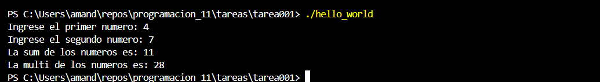

explicacion del programa:
primero se agrega la libreria #include <iostream>,despues se definen las variables como enteros con la funcion int, luego se pone el cout que funciona para imprimir en la terminal lo que uno escriba en el codigo, y el cin para introducir uno mismo la informacion dentro de la terminal, luego se definen las funciones de suma y multiplicacion y al final se imprime con un cout para mostrarlo en la terminal, y se le agruega un endl para hacer un salto de linea.

compilacion:
tiene que entrar dentro del folder con un cd, despues debe de poner g++ "nombre del archivo".cpp -o "nombre del archivo", luego para abrir el programa se pone ./"nombre del archivo" y asi comienza a comenzar el programa del codigo escrito.